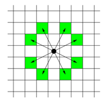

# BFS(Breadth First Search)

다차원 배열에서 각 칸을 방문할 떄 너비를 우선으로 방문하는 알고리즘

## 알고리즘 순서
1. 시작하는 칸을 큐에 넣고 방문했다는 표시를 남김
2. 큐에서 원소를 꺼내어 그 칸에 상하좌우로 인접한 칸에 대해 3번을 진행
3. 해당 칸을 이전에 방문했다면 아무 것도 하지 않고, 처음으로 방문했다면 방문했다는 표시를 남기고 해당 칸을 큐에 삽입
4. 큐에 빌 때 까지 2번을 반복
* 모든 칸이 큐에 1번씩 들어가므로 시간복잡도는 칸이 N개 일때 **O(N)**

```cpp
#include <bits/stdc++.h>
using namespace std;

#define X first
#define Y second // pair에서 first, second를 줄여서 쓰기 위해서 사용
int board[502][502] = 
{{1,1,1,0,1,0,0,0,0,0},
 {1,0,0,0,1,0,0,0,0,0},
 {1,1,1,0,1,0,0,0,0,0},
 {1,1,0,0,1,0,0,0,0,0},
 {0,1,0,0,0,0,0,0,0,0},
 {0,0,0,0,0,0,0,0,0,0},
 {0,0,0,0,0,0,0,0,0,0} }; // 1이 파란 칸, 0이 빨간 칸에 대응
bool vis[502][502]; // 해당 칸을 방문했는지 여부를 저장
int n = 7, m = 10; // n = 행의 수, m = 열의 수
int dx[4] = {1, 0, -1, 0};
int dy[4] = {0, 1, 0, -1}; // 상하좌우 네 방향을 의미

int main(){
    ios::sync_with_stdio(0);
    cin.tie(0);

    queue<pair<int, int>> Q; 
    vis[0][0] = 1; // (0, 0)을 방문했다고 명시
    Q.push({0, 0}); // 큐에 시작점인 (0, 0)을 삽입
    while(!Q.empty()){
        pair<int, int> cur = Q.front(); Q.pop();
        cout << '(' << cur.X << ", " << cur.Y << ") -> ";
        for(int dir=0; dir < 4; dir++){ // 상하좌우 칸을 살펴보기
            int nx = cur.X + dx[dir];
            int ny = cur.Y + dy[dir];
            if(nx < 0 || nx >= n || ny < 0 || ny >=  m) continue; // 범위 밖이 경우 넘어감
            if(vis[nx][ny] || board[nx][ny] != 1)   continue; // 이미 방문한 칸이거나 파란 칸이 아닐경우
            vis[nx][ny] = 1;
            Q.push({nx, ny});
        }
    }
}

```
* pair 사용법 
```cpp
#include <bits/stdc++.h>
using namespace std;

int main(){
    pair<int, int> t1 = make_pair(10, 13);
    pair<int, int> t2 = {4, 6};
    cout << t2.first << ' ' << t2.second << '\n'; // 4, 6
    if(t2 < t1) cout << "t2 < t1"; // t2 < t1 앞쪽값 먼저 비교
}
```

## 예제
### BOJ 1926_그림
1. 상하좌우로 연결된 그림의 크기 찾아내기
2. 도화지에 있는 모든 그림을 찾아내기
```cpp
#include <iostream>
#include <queue>
using namespace std;

#define X first 
#define Y second 

int n, m; // n: 행, m: 열
int num; // 그림의 개수
int board[502][502];
bool vis[502][502];
int dx[4] = {1, 0, -1, 0};
int dy[4] = {0, 1, 0, -1};

void input(){
  cin >> n >> m;
  for(int i=0; i < n; i++){
    for(int j=0; j < m; j++){
      cin >> board[i][j];
    }
  }
  return;
}

int main()
{
  ios::sync_with_stdio(0);
  cin.tie(0);

  input();

  int mx = 0; // 그림 넓이 최댓값
  for(int i=0; i < n; i++){
    for(int j=0; j < m; j++){
      if(!board[i][j] || vis[i][j]) continue;
      num++;
      queue<pair<int, int>> Q;
      vis[i][j] = 1;
      Q.push({i, j});
      int area = 0; // 그림 넓이
      while(!Q.empty()){
        area++;
        pair<int, int> cur = Q.front(); Q.pop();
        for(int dir=0; dir < 4; dir++){
          int nx = cur.X + dx[dir];
          int ny = cur.Y + dy[dir];
          if(nx < 0 || nx >= n || ny < 0 || ny >= m) continue;
          if(vis[nx][ny] || !board[nx][ny]) continue;
          vis[nx][ny] = 1;
          Q.push({nx, ny});
        }
        mx = max(mx, area);
      }
    }
  }
  cout << num << ' ' << mx;
 
  return 0;
}
```
**알고리즘 설계**

1. 큐를 이용하여 상하좌우로 인접한 1들을 방문
2. 방문한 곳은 `vis[nx][ny] = 1`로 표시하여 다시 방문안하게 함
3. 하나의 BFS 수행이 끝나면, 해당 그림의 넓이`area`를 `mx`와 비교하여 최대 넓이 갱신

### BOJ 2178_미로탐색
```cpp
#include <bits/stdc++.h>
using namespace std;

int n,m;
string board[102];
int dx[4] = {1, 0, -1, 0};
int dy[4] = {0, 1, 0, -1};
int vis[102][102];

void input(){
    cin >> n >> m;
    for(int i=0; i < n; i++){
        cin >> board[i];
        fill(vis[i], vis[i]+m, -1); // vis -1로 채움
    }    
    
}

void bfs()
{
    queue<pair<int, int>> q;
    int flag = 0;
    for(int i=0; i < n; i++){
        for(int j=0; j < m; j++){
            if(board[i][j] != '1') continue;
            vis[i][j] = 1;
            q.push({i, j});
            flag = 1;
            break;
        }
        if(flag)    break;
    }

    while(!q.empty()){
        pair<int, int> cur = q.front(); q.pop();
        for(int dir=0; dir < 4; dir++){
            int nx = cur.first + dx[dir];
            int ny = cur.second + dy[dir];
            if(nx < 0 || nx >= n || ny < 0 || ny >= m) continue;
            if(vis[nx][ny] != -1 || board[nx][ny] == '0') continue; // 방문한 적 있거나, 0이면 넘김
            vis[nx][ny] = vis[cur.first][cur.second] + 1;
            q.push({nx, ny});
            //cout << vis[nx][ny] << ' ' << nx << ' ' << ny << endl;
        }
    }
    cout << vis[n-1][m-1];
    return ;
}

int cnt;
int main()
{
    ios::sync_with_stdio(0);
    cin.tie(0);

    input();
    bfs();

    return 0;
}
```
**알고리즘 설계**

1. 큐를 이용하여 상하좌우로 DFS 탐색 시작
2. 방문한 곳은 `vis[nx][ny] != -1`로 표시하여 다시 방문하지 않게 하고, `board[nx][ny] == '0' ` 0인 부분도 탐색하지 않게 함
3. 상하좌우의 탐색하기 전 거리에 + 1해가면서 시작점과의 거리 저장

### BOJ 7576_토마토
**시작점이 여러개인 경우**  
해결 방법: 모든 시작점을 큐에 넣고 시작  
1 = 토마토 익은 경우
0 = 토마토 익지 않은 경우
-1 = 토마토가 없음  
-> 토마토가 익은 곳을 기점으로 상하좌우로만 토마토가 익는다 모두 다 익는데 걸리는 일 수는?

```cpp
#include <bits/stdc++.h>
using namespace std;

#define X first  
#define Y second
int dx[4] = {1, 0, -1, 0};
int dy[4] = {0, 1, 0, -1};
int n, m;
int board[1002][1002];
int dist[1002][1002];

queue<pair<int, int>> q;

void input()
{
    cin >> m >> n;
    for(int i=0; i < n; i++){
        for(int j=0; j < m ;j++){
            cin >> board[i][j];
            if(board[i][j] == 1){ // 시작점을 모두 큐에 넣고 시작~
                q.push({i, j});
            }
            if(board[i][j] == 0){
                dist[i][j] = -1; // 익지않은 토마토는 -1로 구분
            }
        }
    }
    return;
}

void bfs(){
    while(!q.empty()){
        pair<int, int> cur = q.front(); q.pop();
        for(int dir=0; dir < 4; dir++){
            int nx = cur.X + dx[dir];
            int ny = cur.Y + dy[dir];
            if(nx < 0 || nx >= n || ny < 0 || ny >= m) continue;
            // 토마토가 없거나, 이미 방문한 곳이면 넘김
            if(dist[nx][ny] >= 0)   continue;
            cout << nx << ' ' << ny << '\n';
            dist[nx][ny] = dist[cur.X][cur.Y] + 1; // 거리 계산
            q.push({nx, ny});
        }
    }
    return;
}

int main()
{
    ios::sync_with_stdio(0);
    cin.tie(0);

    input();
    bfs();

    int res = 0;
    for(int i=0; i < n; i++){
        for(int j=0; j < m; j++){
            if(dist[i][j] < 0){
                cout << -1;
                return 0;
            }
            res = max(res, dist[i][j]);
        }
    }
    cout << res;
    return 0;
}
```

**알고리즘 설계**  
1. 시작점이 여러개일 때, 큐에 먼저 다 넣고 BFS 시작
2. 익지않은 토마토 거리 -1로 방문여부 체크
3. 토마토 시작점으로 방문할 필요없거나 `vis[nx][ny] = 0` 이미 익지 않은 토마토에 방문한 `vis[nx][ny] > 0` 부분 탐색 pass
4. 상하좌우의 탐색하기 전 거리를 + 1 해가면서 시작점과의 거리를 구해, 총 익는데 걸린 일 수 구함  

### BOJ 4179_불!
```cpp
#include <bits/stdc++.h>
using namespace std;

#define X first
#define Y second
int dx[4] = {1, 0, -1, 0};
int dy[4] = {0, 1, 0, -1};

int R, C;
string board[1002]; // 미로 입력
int jtime[1002][1002]; // 지훈이의 시간
int ftime[1002][1002]; // 불에 대한 시간

void input(){
    cin >> R >> C;
    for(int i=0; i < R; i++){
        cin >> board[i];
        fill(ftime[i], ftime[i] + C, -1);
        fill(jtime[i], jtime[i] + C, -1);
    }

    return;
}

void fire_bfs(){
    queue<pair<int, int>> fq; // 불에 대한 dfs
    for(int i=0; i < R; i++){
        for(int j=0; j < C; j++){
            if(board[i][j] == 'F'){
                fq.push({i, j}); // 불의 시작점
                ftime[i][j] = 0;
            }
        }
    }

    while(!fq.empty()){
        pair<int, int> cur = fq.front(); fq.pop();
        for(int dir=0; dir < 4; dir++){
            int nx = cur.X + dx[dir];
            int ny = cur.Y + dy[dir];
            if(nx < 0 || ny < 0 || nx >= R || ny >= C) continue;
            // 이미 방문한 곳이거나 . 이 아니면 pass
            if(ftime[nx][ny] >= 0 || board[nx][ny] != '.') continue;
            ftime[nx][ny] = ftime[cur.X][cur.Y] + 1;
            fq.push({nx, ny}); 
        }
    }
}

void jihoon_bfs(){
    queue<pair<int, int>> jq; // 지훈이에 대한 dfs
    for(int i=0; i < R; i++){
        for(int j=0; j < C; j++){
            if(board[i][j] == 'J'){
                jq.push({i, j}); // 지훈이의 시작점
                jtime[i][j] = 0;
            }
        }
    }
    
    while(!jq.empty()){
        pair<int, int> cur = jq.front(); jq.pop();
        for(int dir=0; dir < 4; dir++){
            int nx = cur.X + dx[dir];
            int ny = cur.Y + dy[dir];
            // 탈출한 경우 : 범위 벗어난 것은 탈출했다는 소리니까 ~
            if(nx < 0 || ny < 0 || nx >= R || ny >= C){
                cout << jtime[cur.X][cur.Y]+1;
                return;
            }
            // 이미 방문한 곳이거나 .이 아니면 pass
            if(jtime[nx][ny] >= 0 || board[nx][ny] != '.') continue;
            // 불에 의해 통과하지 못하는 경우 : 불이 이미 방문했거나 불이 먼저 도착한 경우
            if(ftime[nx][ny] >= 0 && ftime[nx][ny] <= jtime[cur.X][cur.Y] + 1) continue;
            jtime[nx][ny] = jtime[cur.X][cur.Y] + 1;
            jq.push({nx, ny}); 
        }
    }
    cout << "IMPOSSIBLE";
}

int main(){
    ios::sync_with_stdio(0);
    cin.tie(0);

    input();
    fire_bfs();
    jihoon_bfs();

    return 0;
}
```
**알고리즘 설계**
1. 지훈이와 불에 대한 BFS 각각 나눠서 탐색
2. 불에 대한 탐색시간 먼저 BFS 탐색 통해 구함 -> 이미 방문했거나, .이 아닌 경우(=# 벽인 경우) pass
3. 지훈이에 대한 탐색 시간 통해, 미로 통과 가능한지 안한지 여부 판단
   1. 탐색 시, 미로 크기의 범위를 넘어서면 통과! -> 탐색 시간 반환
   2. pass하는 경우 
   * 이미 방문했거나 .이 아닌 경우 pass
   * 불에 의해 통과하지 못하는 경우 
     - 불이 이미 방문 `ftime[nx][ny] >= 0`
     - 불이 먼저 도착한 경우 `ftime[nx][ny] <= jtime[cur.X][cur.Y] + 1`
   3. DFS 탐색 후에도 반환되지 못했으면, IMPOSSIBLE 출력

### 7562_나이트의 이동
https://www.acmicpc.net/problem/7562  
문제
체스판 위에 한 나이트가 놓여져 있다. 나이트가 한 번에 이동할 수 있는 칸은 아래 그림에 나와있다. 나이트가 이동하려고 하는 칸이 주어진다. 나이트는 몇 번 움직이면 이 칸으로 이동할 수 있을까?  


입력
입력의 첫째 줄에는 테스트 케이스의 개수가 주어진다.

각 테스트 케이스는 세 줄로 이루어져 있다. 첫째 줄에는 체스판의 한 변의 길이 l(4 ≤ l ≤ 300)이 주어진다. 체스판의 크기는 l × l이다. 체스판의 각 칸은 두 수의 쌍 {0, ..., l-1} × {0, ..., l-1}로 나타낼 수 있다. 둘째 줄과 셋째 줄에는 나이트가 현재 있는 칸, 나이트가 이동하려고 하는 칸이 주어진다.
```cpp
// 7562 나이트의 이동
#include <iostream>
#include <queue>
using namespace std;

struct Pos{int y, x; };
int dy[8] = {-2, -2, -1, -1, 1, 1, 2, 2};
int dx[8] = {-1, 1, -2, 2, -2, 2, -1, 1};
int vis[302][302]; // 체스판 방문 여부
int t, l;
Pos start, goal;

void input()
{
    cin >> l;
    cin >> start.y >> start.x;
    cin >> goal.y >> goal.x;

    for(int i=0; i < l; ++i){
        fill(vis[i], vis[i]+l, -1);
    }

    return;
}

void bfs()
{
    queue<Pos> q;
    q.push({start.y, start.x});
    vis[start.y][start.x] = 0; // 시작점 0으로 시작

    if(start.y == goal.y && start.x == goal.x){
        cout << 0 << '\n';
        return;
    }

    while(!q.empty()){
       Pos cur = q.front(); q.pop();
       for(int dir=0; dir < 8; ++dir){
            int ny = cur.y + dy[dir];
            int nx = cur.x + dx[dir];
            if(ny == goal.y && nx == goal.x){
                cout << vis[cur.y][cur.x] + 1 << '\n';
                return;
            }
            if(ny < 0 || nx < 0 || ny >= l || nx >= l)  continue;
            if(vis[ny][nx] >= 0) continue; // 방문한 적 있으면 pass
            vis[ny][nx] = vis[cur.y][cur.x] + 1;
            q.push({ny, nx});
       } 
    }
    return;
}

int main(){

    ios::sync_with_stdio(0);
    cin.tie(0);

    cin >> t;
    while(t--){
        input();
        bfs();
    }

    return 0;
}
```
