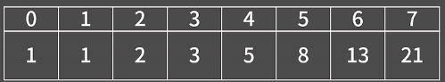

# 다이나믹 프로그래밍
### 다이나믹 프로그래밍
: 여러개의 하위 문제를 먼저 푼 후 그 결과를 쌓아올려 주어진 문제를 해결하는 알고리즘
-> 문제를 해결하기 위해 점화식을 찾아낸 후, 점화식의 항을 밑에서부터 차례로 구해나가서 답을 알아내는 형태!

```cpp
// 재귀
int fibo(int n){
    if(n <= 1)  return 1;
    return fibo(n-1) + fibo(n-2);
}
```

```cpp
int fibo(int n){
    int f[20];
    f[0] = f[1] = 1;
    for(int i=2; i <= n; ++i)
        f[i] = f[i-1] + f[i-2];
    return f[n];
}
```


## DP 푸는 방법
1. 테이블 정의하기  

2. 점화식 찾기  

3. 초기값 정하기  

## 예제
### 9095_1,2,3 더하기

1. 테이블 정의하기  
`D[i] = i`를 1,2,3의 합으로 나타내는 방법의 수

2. 점화식 찾기  
D[4] = ?  
1+1+1+**1**, 3+**1**, 2+1+**1**, 1+2+**1** (3을 1,2,3의 합으로 나타내는 방법)  
1+1+**2**, 2+**2**  (2를 1,2,3의 합으로 나타내는 방법) **+2**, D[2]  
1+**3**(1을 1,2,3의 합으로 나타내는 방법) **+3**, D[1]  
`D[4] = D[1] + D[2] + D[3]`

3. 초기값 정하기  
D[1] = 1, D[2] = 2, D[3] = 4  
D[i] = D[i-1] + D[i-2] + D[i-3] 이니 초기값이 최소 3개는 주어져야함!

```cpp
#include <iostream>
using namespace std;

int t;

int main(){
    ios::sync_with_stdio(0);
    cin.tie(0);

    cin >> t;
    while(t--){
        int n;
        cin >> n;

        int dp[12];
        dp[1] = 1; dp[2] = 2; dp[3] = 4;
        for(int i=4; i <= n; ++i){
            dp[i] = dp[i-1] + dp[i-2] + dp[i-3];
        }
        cout << dp[n] << '\n';
    }
    return 0;
}
```
### 2579_계단오르기 
**2차원 배열로 푸는 법**

1. 테이블 정의하기  
D[i][j] = 현재까지 j개의 계단을 연속해서 밟고 i번째 계단까지 올라섰을 때 점수 합의 최댓값, 단, i번째 계단은 반드시 밟아야 함

2. 점화식 찾기  
S[k] = k번째 계단에 적혀있는 점수  
// k번째 계단까지 왔고, 직전에 1칸 건너뛰고 왔을 때  
`D[k][1] = max(D[k-2][1], D[k-2],[2]) + S[k]`  
// k-1번째 계단을 밟고 바로 k번째 계단을 연속으로 밟았을 때
`D[k][2] = D[k-1][1] + S[k]`

3. 초기값 정하기  
`D[1][1] = S[1]`, `D[1][2] = 0`  
`D[2][1] = S[2]`, `D[2][2] = S[1] + S[2]`
```cpp
#include <iostream>
#include <algorithm>
using namespace std;

int n;
int step[302];
int dp[302][302];

int main(){
    ios::sync_with_stdio(0);
    cin.tie(0);

    cin >> n;
    for(int i=1; i <= n; ++i){
        cin >> step[i];
    }
    // 초기값 설정
    dp[1][1] = step[1];
    dp[1][2] = 0;
    dp[2][1] = step[2];
    dp[2][2] = step[1] + step[2];

    for(int i=3; i <= n; ++i){
        // i번째 계단에 왔을 때, 1칸 건너뛰고 왔을 때 = 즉, i-2번째 계단에서 올라옴
        dp[i][1] = max(dp[i-2][1], dp[i-2][2]) + step[i];
        // i번째 계단에 왔을 때, 직전 계단에서 왔을 때
        dp[i][2] = dp[i-1][1] + step[i];
    }

    cout << max(dp[n][1], dp[n][2]);
    return 0;
}
```

**1차원 배열로 푸는 법**
1. 테이블 정의하기  
    D[i] = i번째 계단까지 올라섰을 때 밟지 않을 계단의 합의 최솟값   
    단, i번째 계단은 반드시 밟지 않을 계단으로 선택해야 함
    => i번쨰 계단을 "건너뛸 때" 생기는 손해 점수의 누적 최소값

2. 점화식 찾기  
    -> 바로 앞 계단(k-1)은 무조건 밟아야 함(안 그러면 2개 연속 안밟게 되니까 경우의수 자체가 나오지 않음)  
    `D[k] = min(D[k-2], D[k-3]) + S[k]`

3. 초기값 정하기  
    `D[1] = S[1]`  
    `D[2] = S[2]`  
    `D[3] = S[3]`  

```cpp
#include <iostream>
#include <algorithm>
using namespace std;

int s[300];
int n;
int dp[300];

int main(void){
    ios::sync_with_stdio(0);
    cin.tie(0);
    
    cin >> n;
    int tot=0;
    for(int i=1; i <= n; ++i){
        cin >> s[i];
        tot += s[i];
    }
    if(n <= 2){
        cout << tot;
        return 0;
    }
    dp[1] = s[1];    dp[2] = s[2];    dp[3] = s[3];
    for(int i=4; i <= n-1; ++i){
        dp[i] = min(dp[i-2], dp[i-3]) + s[i];
    }
    cout << tot - min(dp[n-1], dp[n-2]);
    return 0;
}
```

### 1149_RGB거리###
1. 테이블 정의하기  
`dp[i][0]` = i번째 집의 색깔 선택했을 때, 비용의 최솟값, i번째 집은 빨간색  
`dp[i][1]` = i번째 집의 색깔 선택했을 때, 비용의 최솟값, i번째 집은 초록색  
`dp[i][2]` = i번째 집의 색깔 선택했을 때, 비용의 최솟값, i번째 집은 파란색  
2. 점화식 찾기  
`D[k][0] = min(D[k-1][1], D[k-1][2]) + house[i][0]`  
`D[k][1] = min(D[k-1][0], D[k-1][2]) + house[i][1]`  
`D[k][2] = min(D[k-1][0], D[k-1][1]) + house[i][2]`

3. 초기값 설정  
`dp[1][0] = house[1][0]`  
`dp[1][1] = house[1][1]`   
`dp[1][2] = house[1][2]` 

```cpp
#include <iostream>
#include <algorithm>
using namespace std;

int n;
int house[1002][3];
int dp[1002][3];

int main(){
    ios::sync_with_stdio(0);
    cin.tie(0);

    cin >> n;
    for(int i=1; i <= n; ++i){
        for(int j=0; j < 3; ++j){
            cin >> house[i][j];
            
        }
    }
    // 초기값
    dp[1][0] = house[1][0]; dp[1][1] = house[1][1]; dp[1][2] = house[1][2];

    for(int i=2; i <= n; ++i){
        dp[i][0] = min(dp[i-1][1], dp[i-1][2]) + house[i][0];
        dp[i][1] = min(dp[i-1][0], dp[i-1][2]) + house[i][1];
        dp[i][2] = min(dp[i-1][0], dp[i-1][1]) + house[i][2];
    }
    
    cout << min({dp[n][0], dp[n][1], dp[n][2]});

    return 0;
}
```

### 11726_2xn 타일링  
1. 테이블 정의하기  
`dp[i]` = 2 x i크기의 직사각형을 채우는 방법의 수   
2. 점화식 찾기  
`D[k][0] = min(D[k-1][1], D[k-1][2]) + house[i][0]`  
`D[k][1] = min(D[k-1][0], D[k-1][2]) + house[i][1]`  
`D[k][2] = min(D[k-1][0], D[k-1][1]) + house[i][2]`

3. 초기값 설정  
`dp[1][0] = house[1][0]`  
`dp[1][1] = house[1][1]`   
`dp[1][2] = house[1][2]` 
```cpp
#include <iostream>
using namespace std;

int n;
int dp[1002];
int main(){
    ios::sync_with_stdio(0);
    cin.tie(0);

    cin >> n;
    dp[1] = 1;
    dp[2] = 2;
    for(int i=3; i<=n; ++i){
        dp[i] = (dp[i-1] + dp[i-2]) % 10007;
    }
    cout << dp[n];
    return 0;
}
```
### 11659_구간 합 구하기4  
- prefix sum = 누적합 문제  
`D[i] = A[1] + A[2] ... + A[i]`  
`D[i] = D[i-1] + A[i]`  

`A[i] + A[i-1] + ... + A[j]`  
= `(A[1] + A[2] + ... A[j]) - (A[1] + A[2] + ... + A[i-1])`  
= `D[j] - D[i-1]`  
```cpp
#include <iostream>
using namespace std;

int n, m;
int dp[100002];
int A[100002];

int main(){
    ios::sync_with_stdio(0);
    cin.tie(0);
    cin >> n >> m;
    for(int i=1; i<=n; ++i){
        cin >> A[i];
    }

    // 구간합 구하기
    dp[1] = A[1];
    for(int i=2; i<=n; ++i){
        dp[i] = dp[i-1] + A[i];
    }

    while(m--){
        int i, j;
        cin >> i >> j;s
        cout << dp[j] - dp[i-1] << '\n';
    }

    return 0;
}
```
### 12852_1로 만들기2 ### 
dp[i] : 1로 만들어질 수 있는 횟수 테이블  
pre[i] : 경로 추적용 테이블   


```cpp
#include <iostream>
using namespace std;

int n;
int dp[1000002], pre[1000002];

int main(){
    ios::sync_with_stdio(0);
    cin.tie(0);

    cin >> n;
    dp[1] = 0;
    pre[1] = 0;

    for(int i = 2; i <= n; ++i){
        dp[i] = dp[i-1] + 1;
        pre[i] = i-1;

        if(i % 3 == 0 && dp[i/3] + 1 < dp[i]){
            dp[i] = dp[i/3] + 1;
            pre[i] = i/3;
        }
        if(i % 2 == 0 && dp[i/2] + 1 < dp[i]){
            dp[i] = dp[i/2] + 1;
            pre[i] = i/2;
        }
    }

    cout << dp[n] << '\n';
    
    int cur = n;
    while(1){
        cout << cur << ' ';
        if(cur == 1)    break;
        cur = pre[cur];
    }

    return 0;
}
```

