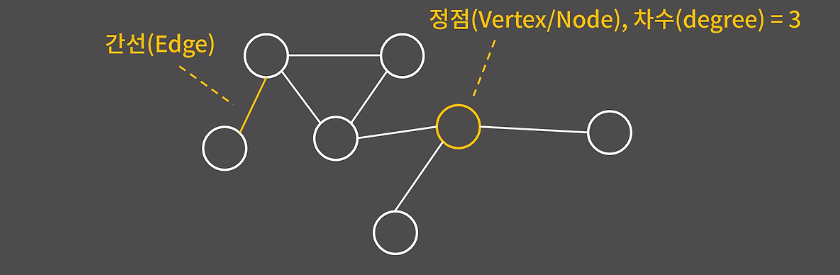
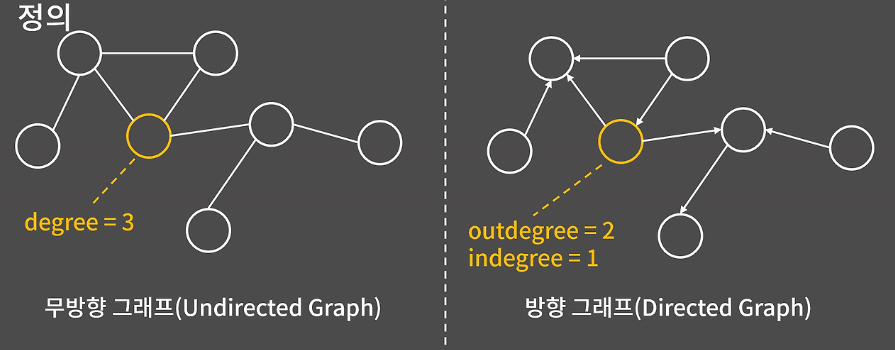
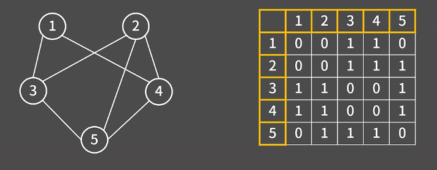
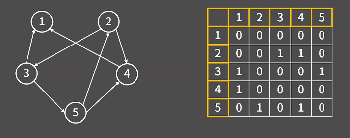
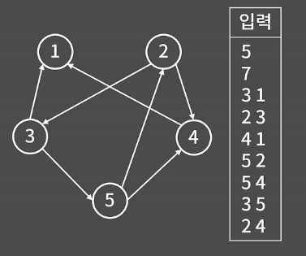
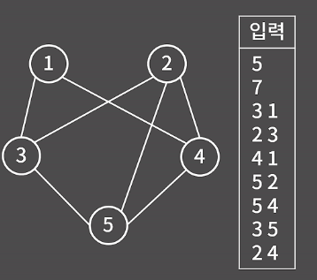
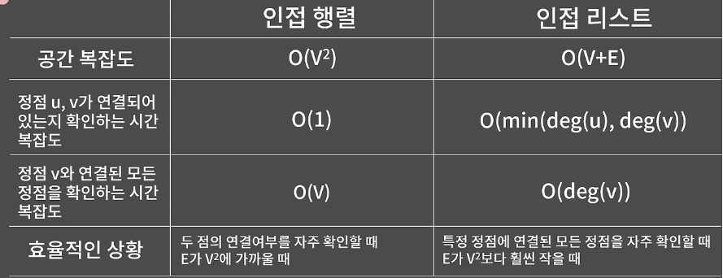
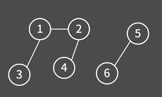
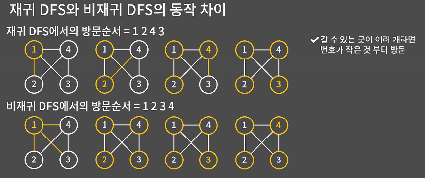

# 그래프
### 정의와 표현법
그래프 = 정점과 간선으로 이루어진 자료구조  
`차수`: 각 정점에 대해서 간선으로 연결된 이웃한 정점의 개수  
  

`무방향 그래프`: 방향성 X  
`방향 그래프`: 방향성 O
  

`순환 그래프` : 사이클(임의의 한점에서 출발해 자기 자신으로 돌아올 수 있는 경로)이 있는 그래프  

**표현법1 - 인접행렬**  

<div align="center">
 <무방향 그래프>
</div>  

```cpp
int adj_matrix[10][10] = {};
int v, e;
cin >> v >> e;
for(int i=0; i < e; ++i){
    int u, v;
    cin >> u >> v;
    adj_matrix[u][v] = 1;
    adj_matrix[v][u] = 1;
}
```

<div align="center">
    <방향 그래프> 
</div>  

```cpp
int adj_matrix[10][10] = {};
int v, e;
cin >> v >> e;
for(int i=0; i < e; ++i){
    int u, v;
    cin >> u >> v;
    adj_matrix[u][v] = 1;
}
```
정점이 V개고, 간선이 E개 일때 어떤 두 점이 연결되어 있는지를 `O(1)`에 확인 가능  
공간복잡도: 정점 V개, 간선 E개 `O(V²)`  

**표현법2 - 인접리스트**  
<div align="center">
    <방향 그래프> 
</div>  

  

// STL 사용 못할 시  
```cpp
int edge[10][2];
int deg[10]; // 각 정점의 outdegree
int* adj[10];
int idx[10]; // adj[i]에서 새로운 정점을 추가할 떄의 위치

int main(){
    int v, e;
    cin >> v >> e;
    for(int i=0; i < e; ++i){
        cin >> edge[i][0] >> edge[i][1];
        deg[edge[i][0]]++; // 각 정점의 outdegree 증가
    }
    for(int i=1; i <= v; ++i){
        adj[i] = new int[deg[i]];
        // 인접 리스트의 크기가 그 정점의 outdegree 크기와 동일
    }
    for(int i=0; i < e; ++i){
        int u = edge[i][0], v = edge[i][1];
        adj[u][idx[u]] = v; // 현재 idx[u] 위치에 v를 저장
        idx[u]++;
    }

}
```

<div align="center">
    <무방향 그래프> 
</div>  


```cpp
int edge[10][2];
int deg[10]; // 각 정점의 degree
int *adj[10];
int idx[10]; // adj[i]에서 새로운 정점을 추가할 때의 위치

int main(){
    int v, e;
    cin >> v >> e;
    for(int i=0; i < e; ++i){
        cin >> edge[i][0] >> edge[i][1];
        deg[edge[i][0]]++;
        deg[edge[i][1]]++;
    }
    for(int i=1; i <= v; ++i){
        adj[i] = new int[deg[i]];
    }
    for(int i=0; i < e; ++i){
        int u = edge[i][0]; int v = edge[i][1];
        adj[u][idx[u]] = v;
        idx[u]++;
        adj[v][idx[v]] = u;
        idx[v]++;
    }
}

```



### BFS
-> 그래프에서 너비를 우선으로 방문하는 알고리즘  

1. 시작하는 정점을 큐에 넣고 방문했다는 표시를 남김
2. 큐에서 정점을 꺼내어 그 정점과 연결된 모든 정점들에 대해 3번을 진행
3. 해당 정점을 이전에 방문했다면 아무 것도 하지 않고, 처음으로 방문했다면 방문했다는 표시를 남기고 해당 칸을 큐에 삽임
4. 큐가 빌 때 까지 2번을 반복
모든 정점이 큐에 최대 1번씩 들어가므로 인접리스트에서 `O(V+E)`, 인접행렬에서는 `O(V²)`   


1) 연결 그래프에서의 순회
```cpp
vector<int> adj[10];
bool vis[10];
void bfs(){
    queue<int> q;
    q.push(1);
    vis[1] = true;
    while(!q.empty()){
        int cur = q.front(); q.pop();
        cout << cur << ' ';
        for(auto nxt : adj[cur]){
            if(vis[nxt])    continue;
            q.push(nxt);
            vis[nxt] = true;
        }
    }
}
```

2. 연결 그래프에서 1번 정점과의 거리  
```cpp
    vector<int> adj[10];
    int dist[10];
    void bfs(){
        fill(dist, dist+10, -1);
        queue<int> q;
        q.push(1);
        dist[1] = 0;
        while(!q.empty()){
            int cur = q.front();
            q.pop();
            for(auto nxt : adj[cur]){
                if(dist[nxt] != -1) continue;
                q.push(nxt);
                dist[nxt] = dist[cur] + 1;
            }
        }
    }
```  
3. 연결 그래프가 아닐 때 순회
  
```cpp
    vector<int> adj[10];
    bool vis[10];
    int v = 9; // 정점의 수
    void bfs(){
        for(int i=1; i <= v; ++i){
            if(vis[i])  continue;
            q.push(i);
            vis[i] = true;
            while(!q.empty()){
                int cur = q.front();
                q.pop();
                for(auto nxt : adj[cur]){
                    if(vis[nxt])    continue;
                    q.push(nxt);
                    vis[nxt] = true;
                }
            }
        }
    }
```  
### DFS  
1. 시작하는 정점을 스택에 넣고 방문했다는 표시를 남김
2. 스택에서 정점을 꺼내어 그 정점과 연결된 모든 정점들에 대해 3번을 진행
3. 해당 정점을 이전에 방문했다면 아무 것도 하지 않고, 처음으로 방문했따면 방문했다는 표시를 남기고 해당 칸을 스택에 삽입
4. 스택이 빌 때까지 2번을 반복
BFS와 같이 모든 정점이 스택에 최대 1번씩 들어가므로 인접리스트에서 `O(V+E)`, 인접행렬에서는 `O(V²)`   

1.연결 그래프에서의 순회, 비재귀 
```cpp
    vector<int> adj[10];
    bool vis[10];
    void dfs(){
        stack<int> s;
        s.push(1);
        vis[1] = true;
        while(!s.empty()){
            int cur = s.top(); s.pop();
            cout << cur << ' ';
            for(auto nxt : adj[cur]){
                if(vis[nxt])    continue;
                q.push(nxt);
                vis[nxt] = true;
            }
        }
    }
```

2. 연결 그래프에서의 순회, 재귀  
```cpp
    vector<int> adj[10];
    bool vis[10];
    void dfs(int cur){
        vis[cur] = true;
        cout << cur << ' ';
        for(auto nxt : adj[cur]){
            if(vis[nxt])    continue;
            dfs(nxt);
        }
    }
```

  
재귀 방식은 실제 방문을 할때 방문 표시를 남김  
비재귀적인 방식은 방문하기 전에 방문하지 않은 곳을 발견하면 그 때 방문 표시  

3. 연결그래프에서의 순회, 비재귀 2
-> 스택메모리 때문에 재귀를 사용할 수 없는 경우에 사용(스택) 
```cpp
    vector<int> adj[10];
    bool vis[10];
    void dfs(){
        stack<int> s;
        s.push(1);
        while(!s.empty()){
            int cur = s.front();
            s.pop();
            if(vis[cur])    continue; // 정점을 한번 씩 넣기 위해 꼭 필요한 코드
            vis[cur] = true;
            cout << cur << ' ';
            for(auto nxt : adj[cur]){
                if(vis[nxt])    continue;
                s.push(nxt);
            }
        }
    }
```

## 예제
### 11724_연결 요소의 개수  
```cpp
#include <iostream>
#include <vector>
#include <queue>
using namespace std;

int n, m, cnt;
vector<int> adj[1002];
bool vis[1002];

void bfs(){
    queue<int> q;
    for(int i=1; i <= n; ++i){
        if(vis[i])  continue;
        q.push(i);
        vis[i] = true;
        cnt++;
        while(!q.empty()){
            int cur = q.front(); q.pop();
            for(auto nxt : adj[cur]){
                if(vis[nxt])    continue;
                q.push(nxt);
                vis[nxt] = true;
            }
        }
    }
    cout << cnt;
    return ;
}

int main(){
    ios::sync_with_stdio(0);
    cin.tie(0);

    cin >> n >> m;
    for(int i=0; i < m; ++i){
        int u, v;
        cin >> u >> v;
        adj[u].push_back(v);
        adj[v].push_back(u);
    }

    bfs();

    return 0;
}
```

### 1260_DFS와 BFS
```cpp
#include <iostream>
#include <algorithm>
#include <vector>
#include <queue>
#include <cstring>
using namespace std;

int n, m, start;
vector<int> adj[1002];
bool vis[1002];

void dfs(int cur){
    vis[cur] = true;
    cout << cur << ' ';
    for(auto nxt : adj[cur]){
        if(vis[nxt])    continue;
        dfs(nxt);
    }
    return;
}

void bfs(){
    //fill(vis, vis+10002, 0); // 초기화
    memset(vis, 0, sizeof(vis));
    queue<int> q;
    q.push(start);
    vis[start] = true;
    while(!q.empty()){
        int cur = q.front(); q.pop();
        cout << cur << ' ';
        for(auto nxt : adj[cur]){
            if(vis[nxt])    continue;
            q.push(nxt);
            vis[nxt] = true;
        }
    }
    cout << '\n';
    return;
}


 
int main(){
    ios::sync_with_stdio(0);
    cin.tie(0);

    cin >> n >> m >> start;
    for(int i=0; i < m; ++i){
        int u, v;
        cin >> u >> v;
        adj[u].push_back(v);
        adj[v].push_back(u);
    }

    // 정접별 인접 리스트 정렬
    for(int i=1; i <= n; ++i){
        sort(adj[i].begin(), adj[i].end());
    }

    dfs(start);
    cout << '\n';
    bfs();

    return 0;
}
```

### 24479_알고리즘 수업 - 깊이 우선 탐색1
```cpp
#include <iostream>
#include <vector>
#include <algorithm>
using namespace std;

int n, m, r, order=1;
vector<int> adj[100002];
bool vis[100002];
vector<int> ans;

void dfs(int cur){
    vis[cur] = true;
    ans[cur] = order++;
    for(auto nxt : adj[cur]){
        if(!vis[nxt])    dfs(nxt);
    }
    return;
}
int main(){
    ios::sync_with_stdio(0);
    cin.tie(0);

    cin >> n >> m >> r;
    ans.resize(n+1, 0); // 1 ~ n까지 사용하므로 n+1 크기로 초기화
    for(int i=0; i < m; ++i){
        int u, v;
        cin >> u >> v;
        adj[u].push_back(v);
        adj[v].push_back(u);
    }

    for(int i=1; i <= n; ++i)
        sort(adj[i].begin(), adj[i].end());

    dfs(r);
    
    for(int i=1; i <= n; ++i)
        cout << ans[i] << '\n';
    
    return 0;
}
```
### 16964_DFS 스페셜 저지
-> DFS 탐색 전 인접리스트의 노드 순서를 정해진대로 정렬한 후 dfs 탐색 필요!   
이걸 생각하는 것이 어려웠음,, 
  
```cpp
#include <iostream>
#include <vector>
#include <algorithm>
using namespace std;

int n, order=1, res=1;
vector<int> adj[100002];
bool vis[100002];
vector<int> ans, pos;

// pos에 따라 정렬(오름차순)
bool cmp(int a, int b){
    return pos[a] < pos[b];
}

void dfs(int cur){
    vis[cur] = true;

    // 방문 순서 안맞으면 바로 종료
    if(cur != ans[order]){
        res = 0;
        return;
    }
    order++;

    for(auto nxt : adj[cur]){
        if(!vis[nxt]){
            dfs(nxt);
            if(res == 0)    return;
        }   
    }
    return;
}

int main(){
    ios::sync_with_stdio(0);
    cin.tie(0);
    
    cin >> n;
    ans.resize(n+1, 0);
    pos.resize(n+1, 0);

    for(int i=0; i < n-1; ++i){
        int u, v;
        cin >> u >> v;
        adj[u].push_back(v);
        adj[v].push_back(u);
    }
    
    for(int i=1; i <= n; ++i){
        cin >> ans[i];
        pos[ans[i]] = i; // ans[i]의 순서 저장
    }
    
    // 각 노드의 인접 노드들을 'ans'의 방문 순서에 맞춰 정렬 필요 
    // 즉, 지정된 노드 탐색 순서로 정렬이 필요 ,,,
    for(int i=1; i <= n; ++i){
        sort(adj[i].begin(), adj[i].end(), cmp);
    }
    dfs(1);
    cout << res;
    return 0;
}
```
