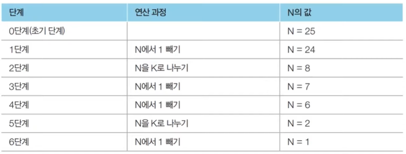

# 그리디
지금 가장 최적이니 답을 근시안적으로 택하는 알고리즘  
= 관찰을 통해 탐색 범위를 줄이는 알고리즘  

### 알고리즘 순서
1. 관찰을 통해 탐색 범위를 줄이는 방법을 고안한다.  
2. 탐색 범위를 줄여도 올바른 결과를 낸다는 강한 믿음을 가진다.
3. 믿음을 가지고 구현해서 문제를 통과한다.  

## 예제
### 11047_동전 0
동전 가치 Ai가 Ai-1의 배수라는 조건 -> 그리디를 가능하게 해줌
**알고리즘**
1. 가치의 합 k를 만들기 위한 동전 개수 최솟값은 가장 높은 금액의 동전부터 사용하도록 탐색
```cpp
#include <iostream>
using namespace std;

int n, k;
int a[15];

int main(){
    ios::sync_with_stdio(0);
    cin.tie(0);

    int ans = 0;
    cin >> n >> k;
    for(int i=0; i < n; ++i)
        cin >> a[i];
    
    for(int i=n-1; i >=0; --i){
        ans += k / a[i];
        k %= a[i];
    }
    cout << ans;
    return 0;
}
```

### 1931_회의실 배정 
-> 가능한 회의 중에서 가장 먼저 끝나는 회의 택하기!

// 내가 짠 코드 // 
-> 람다 함수 사용법 익히기 (두번째 요소로 정렬) -> 중복 조건도 고려!
-> 
```cpp
#include <iostream>
#include <vector>
#include <algorithm>
using namespace std;

int n;
struct Time{int start; int end;};
Time info[100000];

// bool compare(const time &a, const time &b){
//     return a.end < b.end;
// }

int main(){
    ios::sync_with_stdio(0);
    cin.tie(0);
    
    cin >> n;

    for(int i=0; i < n; ++i)
        cin >> info[i].start >> info[i].end;
    
    // 끝나는 시간 기준으로 내림차순으로 정렬
    //sort(info, info+n, compare);
    sort(info, info+n, [](const Time &a, const Time &b){
        // 끝나는 시간 동일하다면 시작하는 시간으로 배치
        // 시작하자마자 끝나는 회의의 존재 떄문 !
        if(a.end == b.end)  return a.start < b.start;
        return a.end < b.end;
    });

    int min_time = info[0].end;
    int ans = 1; // 첫번째 요소 포함 
    for(int i=1; i < n; ++i){
        if(min_time <= info[i].start){
            ans++;
            min_time = info[i].end;
        }
    }
    cout << ans;

    return 0;
}
```

// 다른 코드 //
```cpp
#include <bits/stdc++.h>
using namespace std;

int n;
pair<int, int> s[100005]; // schedule, 정렬의 편의를 위해 {끝 시간, 시작 시간}으로 저장

int main(void){
  ios::sync_with_stdio(0);
  cin.tie(0);
  cin >> n;
  for(int i = 0; i < n; i++)
    cin >> s[i].second >> s[i].first;
  sort(s,s+n); // 먼저 끝나는 시간을 비교하고, 끝나는 시간이 동일하면 시작 시간 순으로 정렬
  int ans = 0;
  int t = 0; // 현재 시간
  for(int i = 0; i < n; i++){
    if(t > s[i].second) continue; // 시작 시간이 현재 시간보다 이전인 회의라면 무시
    ans++; // 시작 시간이 현재 시간 이후인 회의를 찾았으므로 회의의 수에 1 증가
    t = s[i].first; // 현재 시간을 s[i]의 끝나는 시간으로 변경한다.
  }
  cout << ans;
}
```

### 2217_로프
-> 모든 로프 조합 고려하면 $2^n$
-> 최대 중량이 가장 낮은 
```cpp
#include <iostream>
#include <vector>
#include <algorithm>
using namespace std;

int n;
vector<int> w;
int main(){
    ios::sync_with_stdio(0);
    cin.tie(0);

    cin >> n;
    w.resize(n);
    for(int i=0; i < n; ++i){
        cin >> w[i];
    }

    sort(w.begin(), w.end());
    int res = 0;
    for(int i=1; i <= n; ++i){
        res = max(res, w[n-i]*i);
    }
    cout << res;
    
    return 0;
}
```

### 12865_평범한 배낭  
-> 이 문제는 그리디로 최대의 가치대로 정렬한 후, 가치대로 물건들의 최댓값을 구하면 될거 같지만, 실제로는 반례가 생김 
==> 물건을 분할할 수 있다면 그리디 알고리즘이 최적해를 보장했을 것!
-> 따라서 DP가 방법!

### 1이 될때 까지
*문제 설명*  
어떠한 수 N이 1이 될 때까지 다음의 두 과정 중 하나를 반복적으로 선택하여 수행하려고 합니다. 단, 두 번째 연산은 N이 K로 나누어 떨어질 때만 선택할 수 있습니다.  
N에서 1을 뺍니다.  
N을 K로 나눕니다.  
예를 들어 N이 17, K가 4라고 가정합시다. 이때 1번의 과정을 한 번 수행하면 N은 16이 됩니다. 이후에 2번의 과정을 두 번 수행하면 N은 1이 됩니다. 결과적으로 이 경우 전체 과정을 실행한 횟수는 3이 됩니다. 이는 N을 1로 만드는 최소 횟수입니다.  
N과 K가 주어질 때 N이 1이 될 때까지 1번 혹은 2번의 과정을 수행해야 하는 최소 횟수를 구하는 프로그램을 작성하세요.  
문제 조건  
수행 시간: 2초  

입력 조건: 첫째 줄에 N(1 <= N <= 100,000)과 K(2 <= K <= 100,000)가 공백을 기준으로 하여 각각 자연수로 주어집니다.  

출력 조건: 첫째 줄에 N이 1이 될 때까지 1번 혹은 2번의 과정을 수행해야 하는 횟수의 최솟값을 출력합니다.  

입력 예시:

25 5  

출력 예시:  
2

주어진 N에 대하여 최대한 많이 나누기를 수행하면 됩니다.  
N의 값을 줄일 때 2 이상의 수로 나누는 작업을 1을 빼는 작업보다 전체 연산의 횟수를 훨씬 많이 줄일 수 있습니다.  
예를 들어 N=25, K=3일 때는 다음과 같습니다.  


*정당성 분석*  
-> 가능하면 최대한 많이 나누는 작업은 최적의 해를 항상 보장!  
-> N이 아무리 큰 수여도, K로 계속 나누느 것이 기하 급수적으로 빠르게 해를 줄일 수 있기 때문  

```cpp
#include <iostream>
using namespace std;

int n, k;
int main(){
    ios::sync_with_stdio(0);
    cin.tie(0);
    
    cin >> n >> k;

    int res = 0;
    while(1){
        long long target = (n/k) * k;
        res += (n - target); 
        n = target;
        if(n < k)   break;
        n /= k;
        res++;
    }
    
    res += (n - 1);
    cout << res;

    return 0;   
}
```

### 곱하기 혹은 더하기  
```cpp
#include <iostream>
using namespace std;

string s;

int main(){
    ios::sync_with_stdio(0);
    cin.tie(0);
    cin >> s;

    int res = s[0] - '0';
    for(int i=1; i < s.size(); ++i){
        int num = s[i] - '0';
        if(res <= 1 || num <= 1){
            res += num;
        }
        else{
            res *= num;
        }
    }
    cout << res;

    return 0;   
}
```  

### 모험가 길드  
```cpp
#include <iostream>
#include <algorithm>
using namespace std;

int n;
int arr[100002];

int main() {
    ios::sync_with_stdio(0);
    cin.tie(0);

    cin >> n;
    for (int i = 0; i < n; ++i) {
        cin >> arr[i];
    }
    sort(arr, arr + n);

    int cnt = 0, res = 0;
    for (int i = 0; i < n; ++i) {
        cnt++; // 현재 그룹에 해당 모험가 포함
        if (cnt >= arr[i]) {
            res++;
            cnt = 0;
        }
    }
    cout << res;
    return 0;
}
```  

### 체육복 (프로그래머스)  
```cpp
#include <string>
#include <vector>
#include <iostream>
#include <algorithm>

using namespace std;

int solution(int n, vector<int> lost, vector<int> reserve) {
    int ans = n;
    
    sort(lost.begin(), lost.end());
    sort(reserve.begin(), reserve.end());
    
    vector<int> v_lost, v_res(reserve.size(), 0);
    // 여벌 체육복 있는 사람 중 lost 한 사람 있는지 판단 
    for(int i=0; i < lost.size(); ++i){
        bool flag = false;
        for(int j=0; j < reserve.size(); ++j){
            if(lost[i] == reserve[j] && !v_res[j]){
                flag = true;
                v_res[j] = 1;
                break;
            }   
        }
        if(!flag)   v_lost.push_back(lost[i]);
    }
    
    // lost한 사람들 여벌 체육복 빌릴 수 있는지 판단
    for(int i=0; i < v_lost.size(); ++i){
        bool flag = false;
        for(int j=0; j < reserve.size(); ++j){
            if(!v_res[j] && (v_lost[i]-1 == reserve[j] || v_lost[i]+1 == reserve[j])){
                flag = true;
                v_res[j] = 1;
                break;
            }
        }
        if(!flag)   ans--;
    }
    
    return ans;
}
```
