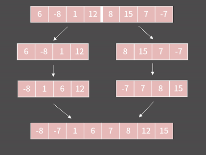

# 정렬
### 기초 정렬
```cpp
int arr[10] = {3, 2, 7, 116, 62, 235, 1, 23, 55, 77};
int n = 10;
for(int i = n-1; i > 0; --i){
    int mxidx = 0;
    for(int j = 0; j <= i; ++j){
        if(arr[mxidx] < arr[j]) mxidx = j;
    }
    swap(arr[mxidx], arr[i]);
}
```

```cpp
int arr[10] = {3, 2, 7, 116, 62, 235, 1, 23, 55, 77};
int n = 10;
for(int i = n-1; i > 0; --i){
    swap(*max_element(arr, arr+i+1), arr[i]);
}
```

*버블 정렬*  
시간 복잡도:  $O(N^2)$  
 ```cpp
int arr[5] = {-2, 2, 4, 6, 13};
int n = 5;
for(int i=0; i < n; ++i){
    for(int j=0; j < n-1-i; ++j){
        if(arr[j] > arr[j+1])   swap(arr[j], arr[j+1]);
    }
}
 ```  

*merge sort*
시간 복잡도: $O(nlogn)$  
  
-> 길이가 1인 리스트를 정렬할 수 있다!  
길이가 N인 두 정렬된 리스트를 합칠 수 있다.  
길이가 N인 리스트를 정렬할 수 있으면 길이가 2N인 리스트를 정렬할 수 있다.  

분할 : O(N) = 1 + 2 + 4 + ... + 2^k = 2N - 1  
합병: O(NlogN)

```cpp
#include <bits/stdc++.h>
using namespace std;

int n = 10;
int arr[1000001] = { 15, 25, 22, 357, 16, 23, -53, 12, 46, 3 };
int tmp[1000001]; // merge 함수에서 리스트 2개를 합친 결과를 임시로 저장하고 있을 변수

// mid = (st+en)/2라고 할 때 arr[st:mid], arr[mid:en]은 이미 정렬이 되어있는 상태일 때 arr[st:mid]와 arr[mid:en]을 합친다.
void merge(int st, int en) {
    int mid = (st + en) / 2;
    int lidx = st; // arr[st:mid]에서 값을 보기 위해 사용하는 idx
    int ridx = mid; // arr[mid:en]에서 값을 보기 위해 사용하는 idx

    for (int i = st; i < en; ++i) {
        if (ridx == en)  tmp[i] = arr[lidx++];
        else if (lidx == mid)  tmp[i] = arr[ridx++];
        else if (arr[lidx] <= arr[ridx]) tmp[i] = arr[lidx++];
        else    tmp[i] = arr[ridx++];
    }

    for (int i = st; i < en; ++i)    arr[i] = tmp[i];
}

// arr[st:en]을 정렬하고 싶다.
void merge_sort(int st, int en) {
    if (en == st + 1) return; // 길이 1인 경우
    int mid = (st + en) / 2;
    merge_sort(st, mid); // arr[st:mid]을 정렬한다.
    merge_sort(mid, en); // arr[mid:en]을 정렬한다.
    merge(st, en); // arr[st:mid]와 arr[mid:en]을 합친다.
}

int main(void) {
    ios::sync_with_stdio(0);
    cin.tie(0);
    merge_sort(0, n);
    for (int i = 0; i < n; i++) cout << arr[i] << ' ';  // -53 3 12 15 16 22 23 25 46 357
}
```

### 11728_배열합치기  
```cpp
#include <iostream>
using namespace std;

int a[1000005], b[1000005], arr[1000005];
int main(){
    ios::sync_with_stdio(0);
    cin.tie(0);

    int n, m;
    cin >> n >> m;


    for(int i=0; i < n; ++i)    cin >> a[i];
    for(int i=0; i < m; ++i)    cin >> b[i];
    
    int aidx = 0, bidx = 0;
    for(int i=0; i < n+m; ++i){
        if(bidx == m)   arr[i] = a[aidx++];
        else if(aidx == n)  arr[i] = b[bidx++];
        else if(a[aidx] <= b[bidx]) arr[i] = a[aidx++];
        else    arr[i] = b[bidx++]; // (a[aidx] > b[bidx])   
    }

    for(int i=0; i < n+m; ++i)  cout << arr[i] << ' ';

    return 0;
}
```
*stable_sort*  
-> **merge sort**는 stable sort이다.  
-> 우선순위가 같은 원소들끼리는 원래의 순서를 따라가도록 하는 정렬  
ex) 2차원 좌표의 정렬 (x좌표가 작은순으로 정렬할 때, x가 같다면 y가 적은 원소가 더 앞으로 정렬)  

*quick sort*
-> 각종 라이브러리는 주로 quick sort로 이루어짐 빨라서!  

```cpp
#include <iostream>
using namespace std;

int n = 10;
int arr[1000001] = {};

void quick_sort(int st, int en) {
    if (en <= st + 1)  return;
    int pivot = arr[st];
    int l = st + 1;
    int r = en - 1;
    while (1) {
        while (l <= r && arr[l] <= pivot) l++;
        while (l <= r && arr[r] > pivot) r--;
        if (l > r)   break;
        swap(arr[l], arr[r]);
    }
    swap(arr[st], arr[r]);
    quick_sort(st, r);
    quick_sort(r + 1, en);
}

int main() {
    ios::sync_with_stdio(0);
    cin.tie(0);
    quick_sort(0, n);
    for (int i = 0; i < n; ++i)    cout << arr[i] << ' ';
    return 0;
}
```

