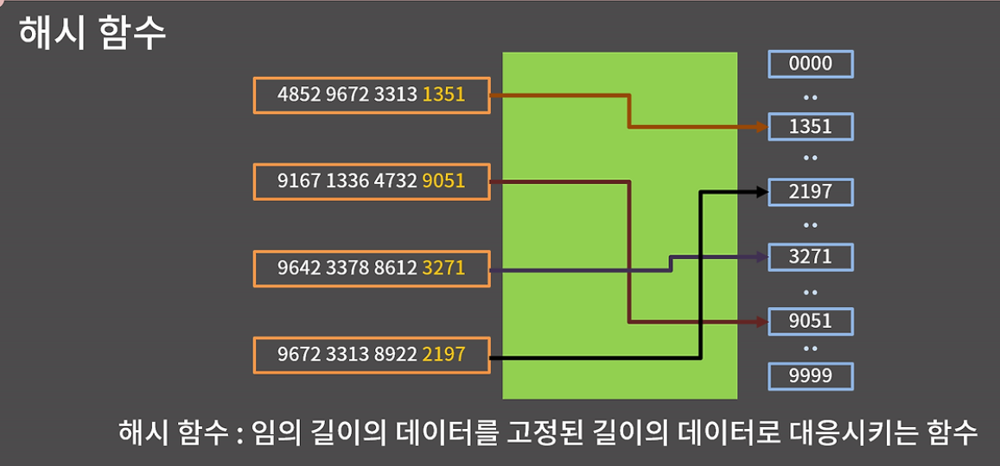

# 해시
-> 키에 대응하는 값을 저장하는 자료구조  
-> 시간복잡도 : insert, erase, find 같은 모든 연산 O(1)  
*해시함수*  
-> 임의 길이의 데이터를 고정된 길이의 데이터로 대응시키는 함수  


## STL ##
### unordered_set 
-> 중복 불가 = set과 동일  
-> 값 자체가 키 
-> 시간복잡도 : 평균적으로 삽입, 삭제, 탐색 O(1)  
-> 중복없이 원소 저장하고 빠르게 포함여부를 확인할 때   
    ex) 방문 여부 체크, 유일한 값 저장 등  
```cpp
#include <iostream>
#include <unordered_set>

using namespace std;
void unordered_set_example(){
    unordered_set<int> s;
    s.insert(-10); s.insert(100); s.insert(15); // {-10, 100, 15}
    s.insert(-10); // {-10, 100, 15}
    cout << s.erase(100) << '\n'; // {-10, 15}, 1
    cout << s.erase(20) << '\n'; // {-10, 15}, 0
    if(s.find(15) != s.end())   cout << "15 in s\n";
    else    cout << "15 not in s\n";

    cout << s.size() << '\n'; // 2
    cout << s.count(50) << '\n'; // 0
    for(auto e : s) cout << e << ' ';
    cout << '\n';
}
```   
### unordered_multiset  
-> 중복 가능  
-> 시간복잡도 : 평균적으로 O(1) 삽입, 삭제, 탐색 (중복 고려 시 약간 느릴 수 있음)  
-> count함수는 O(원소의 개수)  
-> 중복을 허용해야 하면서 빠른 검색이 필요할 때  
    ex) 게임 아이템 인벤토리, 로그 이벤트 수집 등  
```cpp
#include <iostream>
#include <unordered_set>

using namespace std;

void unordered_multiset_example() {
    unordered_multiset<int> ms;
    ms.insert(-10); ms.insert(100); ms.insert(15); // {-10, 100, 15}
    ms.insert(-10), ms.insert(15); // {-10, -10, 15, 15, 100}
    cout << ms.size() << '\n'; // 5
    for(auto e : ms)    cout << e << ' ';
    cout << '\n';
    cout << ms.erase(15) << '\n'; // {-10, -10, 100}, 2
    ms.erase(ms.find(-10)); // {-10, 100} -> 하나만 지우고 싶을 때
    ms.insert(100); // {-10, 100, 100}
    cout << ms.count(100) << '\n'; // 2
}
```  

### unordered_map  
-> 키에 대응되는 값을 찾아주는 STL `(key, value)`  
-> 중복 키 허용 불가  
-> 시간복잡도: 평균적으로 O(1) 삽입, 삭제, 탐색  
-> 특정 key에 대해 **연결된 정보(value)**를 빠르게 찾아야 할 때  
    ex) 단어별 빈도수, ID → 이름 매핑, 설정 값 저장 등
```cpp
#include <unordered_map>

void unordered_map_example() {
    unordered_map<string, int> m;
    m["hi"] = 123;
    m["bkd"] = 1000;
    m["gogo"] = 165; // ("hi", 123), ("bkd", 1000), ("gogo", 165)
    cout << m.size() << '\n'; // 3
    m["hi"] = -7; // ("hi", -7), ("bkd", 1000), ("gogo", 165)
    if (m.find("hi") != m.end()) cout << "hi in m\n";
    else    cout << "hi not in m\n";
    m.erase("bkd"); // ("hi", -7), ("gogo", 165)
    for (auto e : m)
        cout << e.first << ' ' << e.second << '\n';
}
```
