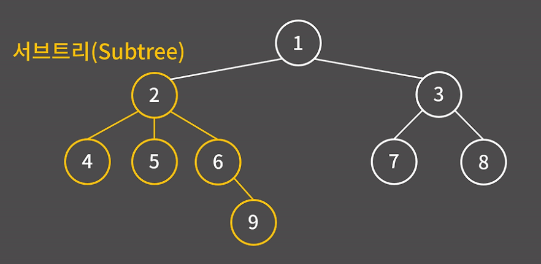
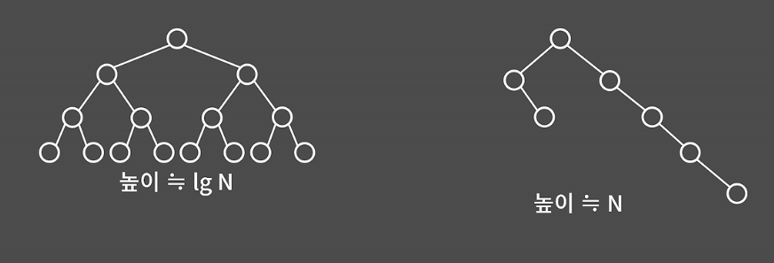

# 이진 검색 트리

### 0. 정의와 성질  
  
- `간선`: 정점 연결하는 선  
- `정점(노드)`: 트리에서의 각 원소  
- `루트`: 트리의 젱리 꼭대기에 위치한 정점  
  
- 간선으로 연결된 위 아래의 관계 = `부모 자식 관계`  
  
- `서브 트리`: 어떤 한 정점에 대해 그 밑에 있는 정점과 간선만을 모은 트리  
ex) 2번 정점에 대한 서브트리  
  
  
- `이진 트리`: 각 노드의 자식이 2개 이하인 트리  
- `이진 검색 트리` : 왼쪽 서브트리의 모든 값은 부모의 값보다 작고 오른 쪽 서브트리의 모든 값은 부모의 값보다 큰 이진 트리  

장점: insert, erase, find update 모두 `O(logN)` 처리 가능  

### 1. 기능
시간복잡도는 트리의 높이가 얼마인지에 따라 결정된다.  
  
-> 왼쪽 트리처럼 각 정점이 대부분 2개의 자식을 가지고 있다면 높이가 하나 내려갈 때 마다, 자식의 수가 1 2 4 8 ... 이렇게 2배 씩 증가하기 떄문에 N 개있다면 높이가 대략 logN이므로, 시간복잡도는 `O(logN)`  
-> 오른쪽 그림처럼 트리가 편향되어 있다면, 높이가 O(N)에 가깝기 때문에 시간복잡도가 `O(N)`이므로, 이진 검색 트리 쓰는 이유가 없음.  

### 2. 자가 균형 트리  

`자가 균형 트리`: 트리의 불균형이 발생햇을 떄, 트리를 꺽어버림  
ex) AVL 트리, Red black 트리  
=> 편향성을 해소해주는 자가 균형 트리를 사용할 때 비로소, 이진 검색 트리에서 삽입, 검색, 삭제가 모두 `O(logN)`  

### 3. STL  
**1. set**  
- unordered_set과의 차이점은 정렬이 되어있다는 점. => 원소를 찾을 때 `O(logN)`으로 해결 가능  
-  중복 안됨 !  
```cpp
void set_example() {
    set<int> s;
    s.insert(-10); s.insert(100); s.insert(15); // {-10, 15, 100}
    s.insert(-10); // {-10, 15, 100}
    cout << s.erase(100) << '\n'; // {-10, 15}, 1
    cout << s.erase(20) << '\n'; // {-10, 15}, 0
    if (s.find(15) != s.end())   cout << "15 in s\n";
    else    cout << "'15 not in s\n";
    cout << s.size() << '\n'; // 2
    cout << s.count(50) << '\n'; // 0
    for (auto e : s) cout << e << '\n'; // 0
    cout << '\n';
    s.insert(-40); // {-40, -10, 15}
    set<int>::iterator it1 = s.begin(); // {-40(<-it1), -10, 15}
    it1++; // {-40, -10(<-it1), 15}
    auto it2 = prev(it1); // {-40(<-it2), -10, 15}
    it2 = next(it1); // {-40, -10, 15(<-it2)}
    advance(it2, -2); // {-40(<-it2), -10, 15}
    auto it3 = s.lower_bound(-20); // {-40, -10(<-it3), 15}
    auto it4 = s.find(15); // {-40, -10, 15(<-it4)}
    cout << *it1 << '\n'; // -10
    cout << *it2 << '\n'; // -40
    cout << *it3 << '\n'; // -10
    cout << *it4 << '\n'; // 15
}
```  
**2. multiset**  
- 중복 허용  
```cpp
 void multiset_example(){
  multiset<int> ms;
  // {-10, 15, 100}
  ms.insert(-10); ms.insert(100); ms.insert(15); // {-10, -10, 15, 15, 100}  
  ms.insert(-10); ms.insert(15);
  cout << ms.size() << '\n'; // 5
  for(auto e : ms) cout << e << ' ';
  cout << '\n';
  cout << ms.erase(15) << '\n'; // {-10, -10, 100}, 2
  ms.erase(ms.find(-10)); // {-10, 100}
  ms.insert(100); // {-10, 100, 100}
  cout << ms.count(100) << '\n'; // 2
  auto it1 = ms.begin(); // {-10(<-it1), 100, 100}
  auto it2 = ms.upper_bound(100); // {-10, 100, 100} (<-it2)
  auto it3 = ms.find(100); // {-10, 100(<-it3), 100}
  cout << *it1 << '\n'; // -10
  cout << (it2 == ms.end()) << '\n'; // 1
  cout << *it3 << '\n'; // 100
}
```  
->  `cout << ms.erase(15) << '\n'; // {-10, -10, 100}, 2` : 15가 2개 지워져서 value 2  
-> 제일 먼저 등자하는 원소의 iterator가 필요하다면 find 대신 `lower_bound` 사용하자.  

**3. map**  
-> key로 value 찾는 STL
```cpp
void map_example() {
    map<string, int> m;
    m["hi"] = 123;
    m["bkd"] = 1000;
    m["gogo"] = 165; // ("bkd, 1000"), ("gogo", 165), ("hi", 123)
    cout << m.size() << '\n'; // 3
    m["hi"] = -7; // ("bkd, 1000"), ("gogo", 165), ("hi", -7)
    if(m.find("hi") != m.end()) cout << "hi in m\n";
    else    cout << "hi not in m\n";
    m.erase("bkd"); // ("gogo", 165), ("hi", 123)
    for(auto e : m) cout << e.first << ' ' << e.second << '\n';
    auto it1 = m.find("gogo");
    cout << it1->first << ' ' << it1->second << '\n';
}
```  
**TIP**  
문제 풀다가 set, map이 필요하면서 특히 lower_bound나 prev, next 이런걸 사용해야 풀리는거라면 꼭 STL set, map으로 해결하기!! -> unordered 말구,,, 

### 예제   
BOJ 1202: 보석 도둑  
-> 처음에는 knapsack DP 문제인 줄 알았는데 이게 set이랑 어떤 연ㅇ관인지도 모르겠고,, 음 우선 보석을 한 가방에 하나밖에 못담아서 아마 안되지 않을까 ?라 생각듬  

-> `그리디`로 접근  
= 가장 가격이 높은 보석부터 확인하며 해당 보석을 담을 수 있는 가방 중 가장 적은 무게의 가방에 담으면 최대 보석 가치의 합이 될 것이다. 

```cpp
#include <iostream>
#include <set>
#include <vector>
#include <algorithm>
using namespace std;

int n, k;
vector<pair<int, int>> jewel;
multiset<int> bag;

int main() {
    ios::sync_with_stdio(0);
    cin.tie(0);

    cin >> n >> k;
    for (int i = 0; i < n; ++i) {
        int m, v;
        cin >> m >> v;
        jewel.push_back({ v, m });
    }
    // sort(jewel.begin(), jewel.end(), [](const pair<int, int>& a, const pair<int, int>& b) {
    //     return a > b;
    //     });
    sort(jewel.begin(), jewel.end(), greater<>()); // 내림차순 -> 보석 가장 큰거부터

    for (int i = 0; i < k; ++i) {
        int w;
        cin >> w;
        bag.insert(w);
    }

    long long ans = 0;
    for (auto j : jewel) {
        // 해당 주얼리에 담을 수 있는 가장 작은 가방 찾음.
        auto it = bag.lower_bound(j.second);
        if (it != bag.end()) {
            ans += j.first;
            bag.erase(it); // 가방 하나 사용 완료
        }
    }
    cout << ans;

    return 0;
}
```  
-> 가방: multiset으로 모두 O(logN)  
--> 이 알고리즘 방식은 보석 기준 탐색! 가방마다 가방 무게의 들어갈 수 있는 최대 가치의 보석을 넣기.  
-> 우선순위큐를 사용한다면 가방 기준 탐색이 가능하다. 