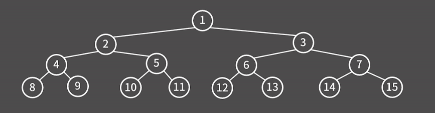
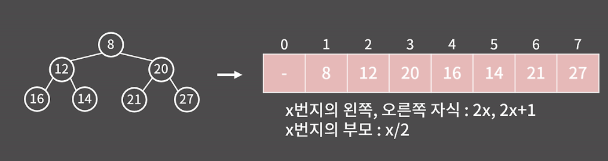

# 우선순위 큐 
### 0. 정의와 성질  
`우선 순위 큐`: pop을 할 때, 가장 먼저 들어온 원소가 나오는 대신 우선순위가 가장 높은 원소가 나오는 큐  

1. 원소의 추가가 `O(logN)`  
2. 우선순위가 가장 높은 원소의 확인이 `O(1)`  
3. 우선순위가 가장 높은 원소의 제거가 `O(log N)`  

### 1. 기능과 구현  


`최소 힙` : 최소값을 찾기 위해 사용하는 힙 -> 부모가 자식보다 작아야함  
`최대 힙` : 최댓값을 찾기 위해 사용하는 힙 -> 부모가 자식보다 커야함  

1. `insert`: 삽입의 시간복잡도는 `O(logN)` -> 최대 높이 만큼만 올라가면서 자리를 바꿔주고, 힙의 구조상 균형 트리기 때문.  
2. `fetch`: 루트에 적힌 값 = 최솟값 or 최댓값 -> 단, 10번쨰로 찾은값, 그 반대의 값(최대 or 최소)를 확인하는 것은 불가능.  
3. `erase`: 최솟값을 지우는 방법은, 가장 마지막 위치인 루트와 위치를 바꾸고 루트를 안전하게 제거 후, 힙의 성질이 잘 만족되도록 내부적으로 위치를 바꾸는 방식으로 구현  

<div align="center">
구현 방식
</div>  

-> set말고 priority_queue를 사용하는 이유? 빅오 관점에서 set보다 수행 속도가 빠르고, 공간도 적게 사용 가능

### 2. STL 사용법  
```cpp
#include <queue>
#include <iostream>

using namepsace std;

int main(){

    priority_queue<int> pq; // 최대 힙
    // priority_queue<int, vector<int>, greater<int>>로 선언 시 최소 힙
    pq.push(10); pq.push(2); pq.push(5); pq.push(9); // (10, 2, 5, 9)
    cout << pq.top() << '\n'; // 10
    pq.pop(); // (2, 5, 9)
    cout << pq.size() << '\n'; // 10
    if(pq.empty())  cout << "PQ is empty \n";
    else    cout << "PQ is not empty\n";
    pq.pop(); // (2, 5)
    cout << pq.top() << '\n'; // 5
    pq.push(5); pq.push(15); // (2, 5, 5, 15)
    cout << pq.top() << '\n'; // 15
    
}
```
 
### 3. 연습 문제  
`11286. 절댓값 힙`  
```cpp
#include <iostream>
#include <queue>
#include <cmath>
using namespace std;

class cmp {
public:
    bool operator()(int a, int b) {
        if (abs(a) == abs(b))    return a > b;
        else    return abs(a) > abs(b);
    }
};

int main() {
    ios::sync_with_stdio(0);
    cin.tie(0);

    priority_queue<int, vector<int>, cmp> pq;
    int n;
    cin >> n;
    while (n--) {
        int x;
        cin >> x;
        if (x == 0) {
            if (pq.empty())  cout << 0 << '\n';
            else {
                cout << pq.top() << '\n';
                pq.pop();
            }
        }
        else {
            pq.push(x);
        }
    }

    return 0;
}
```
-> cmp는 클래스로 구현해야함.  
-> c++ 표준에서 `comp(a, b) == true` -> a의 우선순위가 b보다 낮다는 말 = 즉, b가 top에 가깝다는 말 

